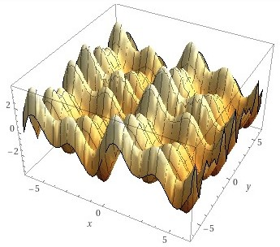
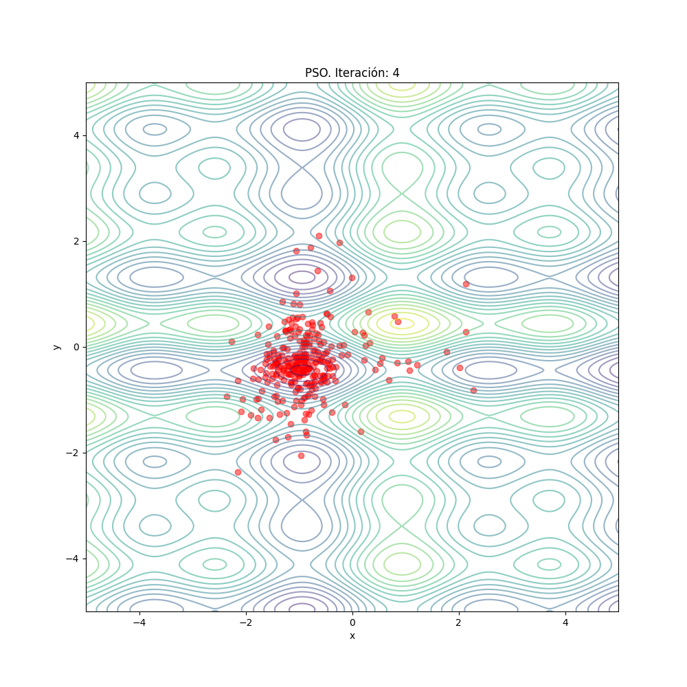

# Demo_PSO
Demostración de algoritmo Particle Swarm Optimization.
Se minimiza funciones matematicas con el algoritmo de Particle swarm optimization.

Se asume de manera didactia que las particulas de enjambres son "peces" y el grupo o enjambre se ha denominado *"cardumen"*.

## Estructura de archivos
```
├── img
├── .pylintrc
├── funciones.py
├── main.py
├── README.md
└── requirements.txt
```

**funciones.py**: Archivo donde se encuentran las funciones para ser minimizadas.
Ejemplo: 
```python
import numpy as np
def esfera(vector_x):
    """
    Función esfera
    """
    cor_x = vector_x[0]
    cor_y = vector_x[1]
    return cor_x**2 + cor_y**2
```

**main.py**: Archivo principal donde se crea la definición de particula o "pez" y se crea un cardumen de peces para realizar busqueda de un punto minimo en la funcion que se elija.

## Ejemplos de desarrollo

### función multimodal para minimizar


### PSO corriendo



## Como ejecutar?

para ejecutar este algoritmo se puede realizar los siguientes pasos:

1. Clonar el repositorio:
```bash
git clone https://github.com/AndresInsuasty/Demo_PSO.git
```
2. Crear un ambiente virtual:
```bash
python -m venv venv
```
3. Instalar dependencias:
```bash
pip install -r requirements.txt
```
4. Ejecutar algoritmo
```bash
python main.py
```

Esto guardará graficas de los resultados en el path `img/resultados` esto lo guardara con el nombre de la función e iteración del algoritmo.

Para cambiar los parametros de la optimización puede ir a la parte final del archivo `main.py` 

```python
limite = [-5,5] #limites del espacio de busqueda
num_peces = 20 # numero de peces en el cardumen
max_iteraciones = 5 # numero maximo de iteraciones, este es el criterio de parada
w = 0.5 #peso o relevancia que se le da a la inercia del pez o particula
c1 = 0.5 #importancia que se le da al conocimiento o experiencia cognitiva
c2 = 0.5 #importancia que se le da al conocimiento e experiencia del cardumen
```
